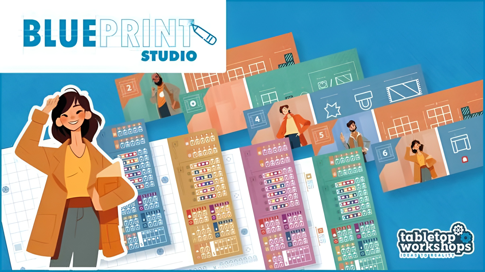

 



## Project info

<table>
    <thead>
        <tr>
            <th>Role</th>
            <th>&nbsp;&nbsp;&nbsp;&nbsp;&nbsp;&nbsp;Description</th>
        </tr>
    </thead>
    <tbody>
         <tr>
            <td>
              Game Designer
              
              Co-design
              
            </td>
            <td>&nbsp;&nbsp;&nbsp;&nbsp;&nbsp;&nbsp;Co-designed core mechanics and game phases.</td>
        </tr>
    </tbody>
</table>

__Team members:__ 2

__Game Type:__ Board game

__Genre:__ Roll and write

## About

Blueprint Studio is a roll and write game for 1 to 4 players where players take the ole of architects who have to draw the plans for a house and complete rooms with the right objects. Whoever designs the house with the highest value, wins.

I co-designed this board game with the talented [Alejandro Luna](https://www.linkedin.com/in/manuel-alejandro-luna-arce-2b27542a4/) as a college projecet. It was well received by our professors, José Macías and Ruben Hernandez, who offered us the opportunity to take it further and collaborate with Tabletop Workshops to launch a Kickstarter campaign.

## Kickstarter campaign





