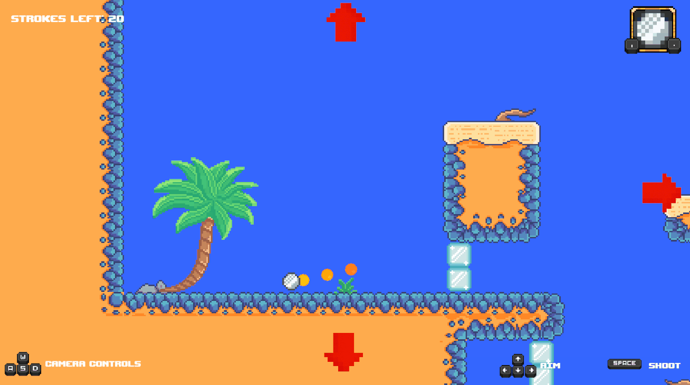
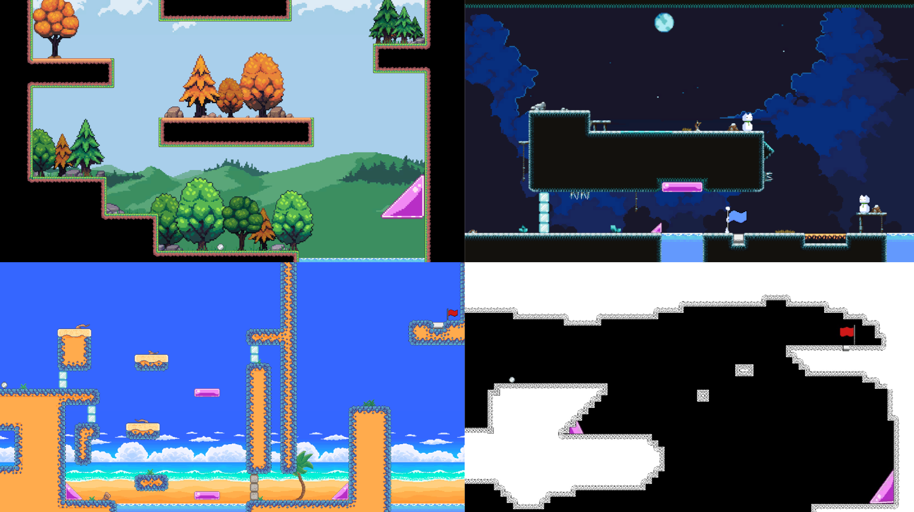
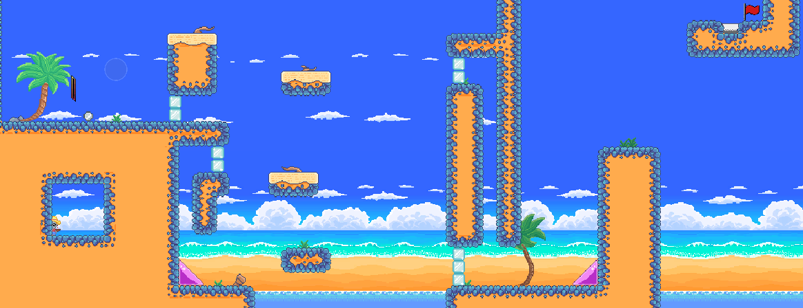
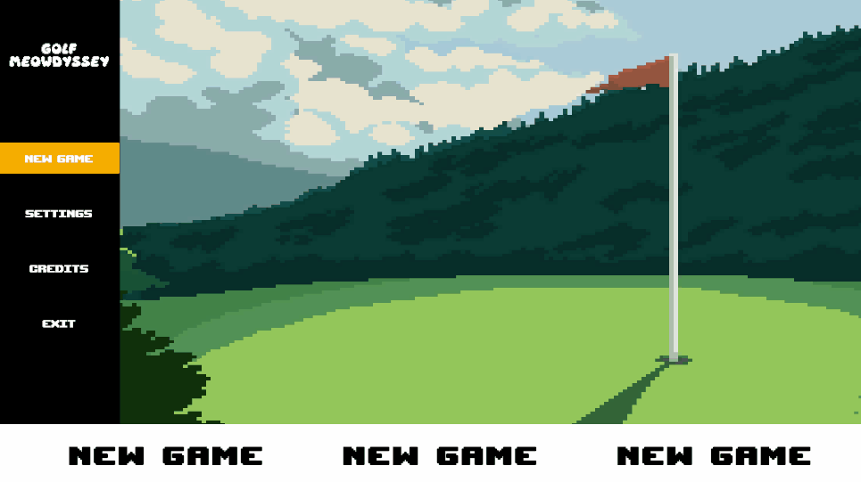

## Project info

__Engine:__ Unity

__Platforms:__ Windows

__Team members:__ 3

A 2D pixel art golf platformer, where a cat, that has lost all of its lives and wakes up in Limbo, has to beat the Limbo God to come back to life. This project was built as hands-on training for an entry-level role, applying professional-grade architecture and best practices from day one. Following SOLID principles reviewed by the talented [Iván Herrera](https://www.linkedin.com/in/ivan-herrera-m/).

<iframe frameborder="0" src="https://itch.io/embed/3620741?bg_color=191919&amp;fg_color=ffffff&amp;link_color=feb321&amp;border_color=feb321" width="552" height="167"><a href="https://elerizio.itch.io/golf-meowdyssey">Golf Meowdyssey by ElErizio, cvg42, IXAL8</a></iframe>

### Features

- Phased shot system: adjust your direction, pick your strenght and shoot. Aim carefully as the force bar fills and empties to land the perfect shot. But be careful, your shots are limited.

- Free camera controls: move the camera before you make your shot to explore the level and plan your move.

- Power-ups: collect and use power-ups granted by cat spirits in each stage to overcome new challenges.

- Charming dialogues: follow a fun and mischievous narrative through in-game dialogues.
- Level variety: play across different themed stages, offering new puzzles.

## What I did

I took on multiple responsibilities throughout the project, focusing primarily on gameplay and systems programming

- Architecture: designed the code architecture, ensuring each system followed the single-responsibilty principle for clean and scalable code.
- Systems programming: implemented core systems such as save/load system by slots, asynchornous scene loading using UniTask, UI, input and audio management.
- Gameplay programming: handled player ball throwing mechanic, fine-tuned physics, and built level selection logic.
- Debugging: resolved gameplay and system-level bugs and used Unity's debugging tools along with Visual Studio's debugging features to identify the issues if needed.
- Level design: designed the 4th level of the game implementing a time stoping power-up.

- UI programming: designed and created a functional main menu along with settings and pause menus with smooth transitions and animations using DOTween.



## Credits

- Project Manager: [Iván Herrera](https://www.linkedin.com/in/ivan-herrera-m/).
- Game and level designer, camera and dialogue system: [Ivan Antonio](https://www.linkedin.com/in/ixal8/)
- Cats and pixel art animations: [Joaquin Cuesta](https://www.instagram.com/ovalemus/) 
- Art supervisor: [Eric Rosas](https://www.linkedin.com/in/eric-i-rosas/)
