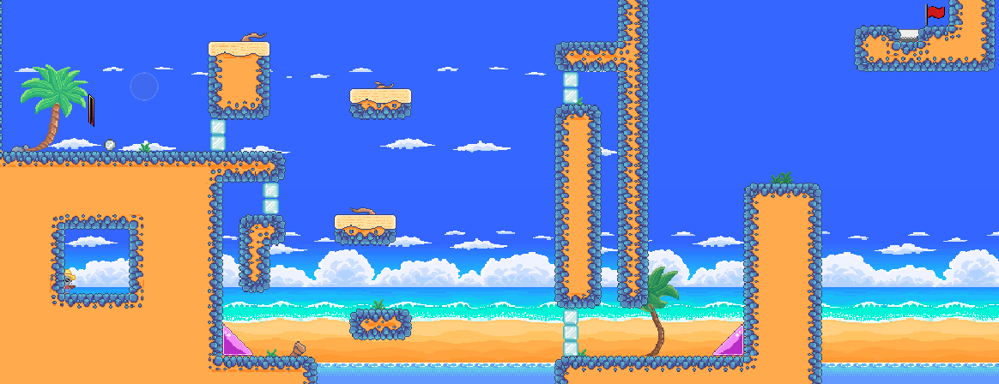
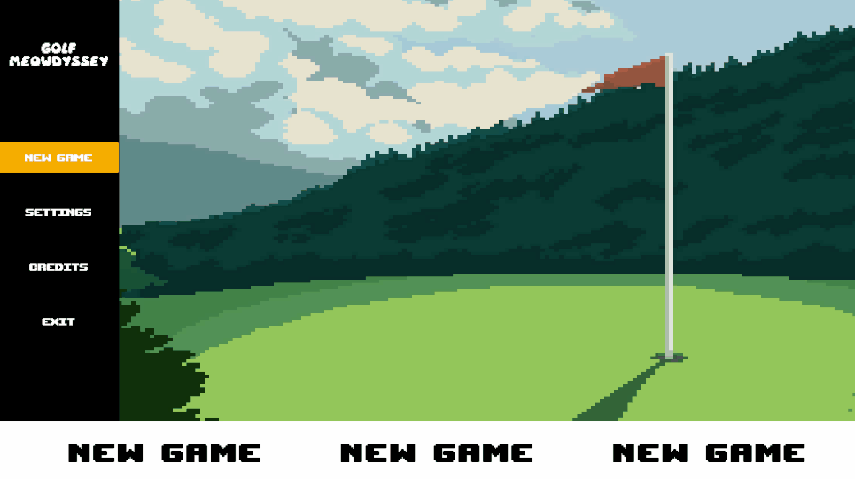

## Project info

__Engine:__ Unity

__Platforms:__ Windows

## My Contributions

I took on multiple responsibilities throughout the project, focusing primarily on gameplay and systems programming

- Architecture: designed the code architecture, ensuring each system followed the single-responsibilty principle for clean and scalable code.
- Systems programming: implemented core systems such as save/load system by slots, asynchornous scene loading using UniTask, UI, input and audio management.
- Gameplay programming: handled player ball throwing mechanic, fine-tuned physics, and built level selection logic.
- Debugging: resolved gameplay and system-level bugs and used Unity's debugging tools along with Visual Studio's debugging features to identify the issues if needed.
- Level design: designed the 4th level of the game implementing a time stoping power-up.

- UI programming: designed and created a functional main menu along with settings and pause menus with smooth transitions and animations using DOTween.


