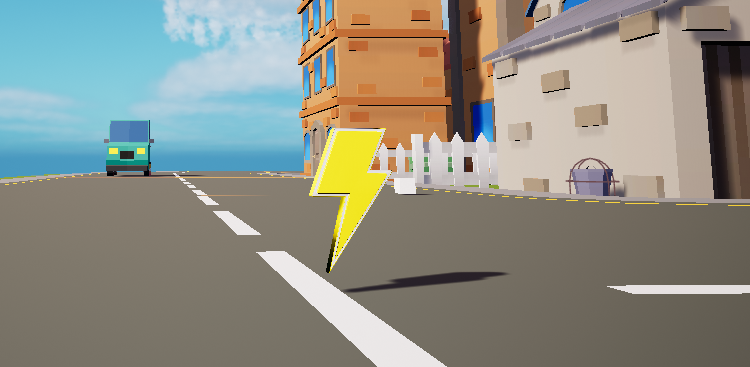
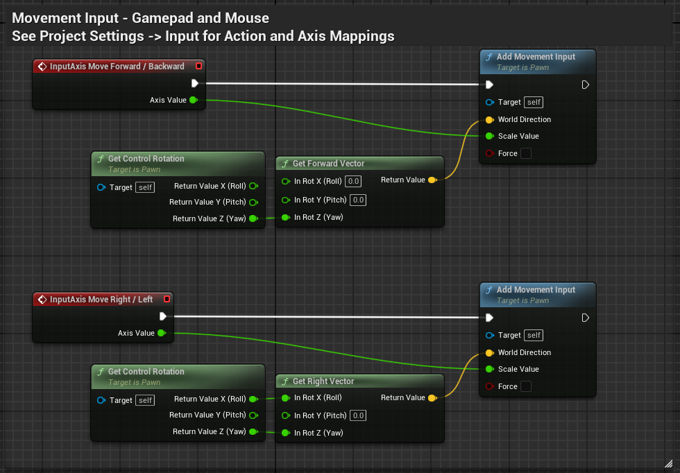
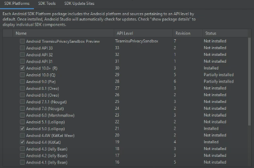

## Project info

__Engine:__ Unreal Engine 5.0

__Platforms:__ Windows, Android

A Katamari inspired game made in Unreal Engine 5 as practice project. Like in Katamari, the player controls a sphere that rolls around collecting objects scattered across the map before the time's up. The more objects are collected, the bigger the sphere grows in size.



### Features

- __Roll:__ move around freely and roll over objects to collect them.

![Roll movement][def]

- __Grow:__ pick up objects to increase your size and pick up even bigger objects.

![Grow][def2]

- __Speed boost:__ find and pick speed boosts around the map that will help you go faster.

- __In-Game music selection:__ you can select the song you want to play with.

## Things I learned

This wasn't my first project in Unreal Engine, but it was the first time I experimented more with mechanics out of the norm but without going too overboard. I love the Katamari franchise, so I thought it would be a nice idea to make my own version of it to practice. I only limited myself to blueprints since it was a really small project.

### Roll movement
The rolling movement itself wasn't hard to implement as it was straightforward to apply the object's rotation to the correct vector axis.

### Metasounds
A really distinctive feature of the Katamari franchise is its music, which draws a lot of inspiration from the Japanese pop sub-genre [Shibuya-kei](https://en.wikipedia.org/wiki/Shibuya-kei). I really wanted to capture that vibe in my project, so I set out to find songs that matched the style and mood to include in the game.. While I was thinking of how to implemnt an in-game music player that lets the player choose which song they want to listen to during the game, I stumbled across [MetaSounds](https://dev.epicgames.com/documentation/en-us/unreal-engine/metasounds-in-unreal-engine), a really complete audio system I had never heard of before. After reading some documentation, I found out that I can make my own music library and trigger switches to change the song linking them to the music player's widget buttons to skip to the next or previous song.



### Android build
Having experience developing mobile games in Unity, to make Android builds is fairly easy. You only have to install the necessary SDKs and JDKs through the Unity Hub installer. But I didn't know it was a bit more complicated to do so in Unreal Engine 5.

First, I had to go to Visual Studio and install the Windows 11 and 10 SDKs. Then, I had to download [Android Studio](https://developer.android.com/studio) and choose the SDK platforms.

I also had to pick the correct SDK Tools and thanks to a [post](https://forums.unrealengine.com/t/turnkey-for-mobile-is-missing/561090/14) in the Unreal Engine forum, I managed to set them correctly.

The real trouble happened while installing the JDKs, I had to go through Oracle's JDK version history and downnload the proper JDK according to the Unreal Engine version I was using back then, which is 5.0, but it didn't stop there. In order for the JDK to work, I had to set a new environment variable dedicated to the newly downloaded file in my desktop. Then do the Android Setup directly on my Unreal Engine's folder and from there setup the local SDK paths directly in the Unreal Engine editor.

It was tedious, but I was able to make build an .apk in Unreal Engine 5.0. Here's a video of the game running on Android, the quality isn't the best.



## Credits

- 3D assets: [Low Poly Town](https://www.fab.com/listings/33330547-e825-45b8-9aac-cfa0e8266eab) by [PolyArt3D](https://www.fab.com/sellers/PolyArt3D)

- Music: songs are not mine and I give all credits to [capsule](https://www.capsule-official.com/). Here's a list of the songs I used:
    - [Candy Cutie (Instrumental)](https://www.youtube.com/watch?v=K7sEUNgaoN0) by capsule
    - [Happy life generator (Instrumental)](https://www.youtube.com/watch?v=q6wCId3l_nM) by capsule
    - [Uchuu elevator (Instrumental)](https://www.youtube.com/watch?v=sJ40hDme4F0) by capsule
    - [Idol fancy (Instrumental)](https://www.youtube.com/watch?v=fnhYkHJnLW4) by capsule
    - [Ocean blue sky orange (Instrumental)](https://www.youtube.com/watch?v=QY9TUXdv6Ms) by capsule
    - [Tokyo smiling (Instrumental)](https://www.youtube.com/watch?v=C6CWKaOfVl0) by capsule
    - [Plastic girl (Instrumental)](https://www.youtube.com/watch?v=Hfqcf5faiCI) by capsule


**DISCLAIMER:** This project was just made for fun and not commercial intends. Since it has copyrighted music, it's not available in sites such as itch.io either


[def]: katamarimove.gif
[def2]: katamarigrow.gif