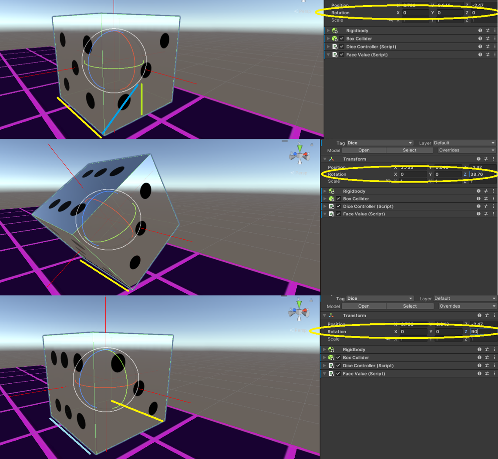
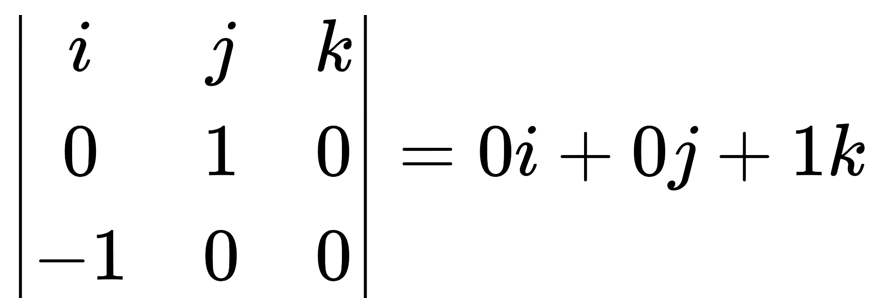
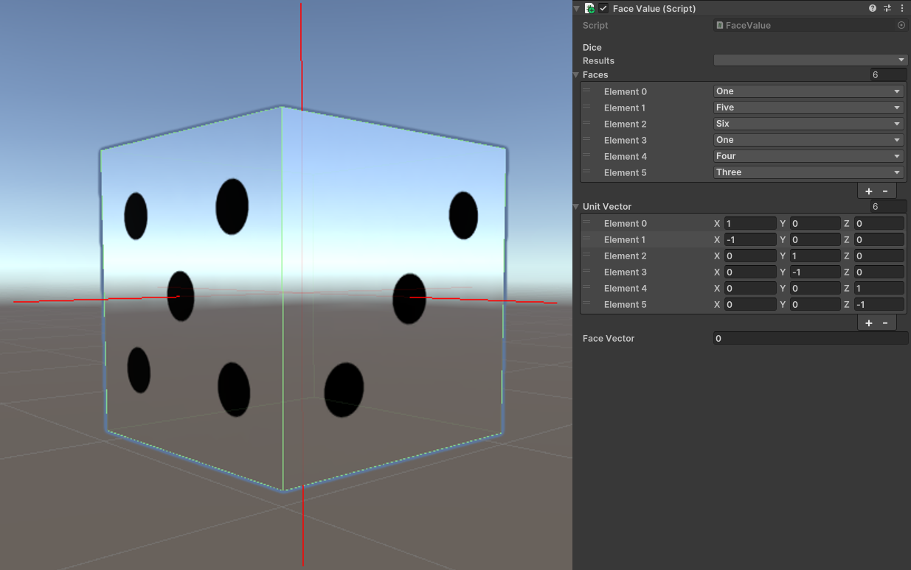

## Project info

__Engine:__ Unity

__Platforms:__ Windows

This is a small Unity project designed to practice math and linear algebra concepts through code. You control a dice that rolls across a grid, face by face. The goal is to bring the score down to zero. To do so, you must step on numbered cells to trigger the score change, the dice's top face value is multiplied by the cell's number and subtracted from the total score. Each numbered cell can only be used once, so plan your moves carefully.



### Features

- Grid based rolling: move the dice across a grid, but careful, you have to plan your moves.
- Math driven puzzles: each level challenges your logic and math skills.
- Retrowave aesthetic: enjoy the glowing colors and synth music.


## Things I learned

I've always liked linear algebra and math, so I took this as an opportunity to implement them through code. Unity offers many functions to do it directly.

### Cross Product
The cross product is widely used in games and 3D graphics. It takes two vectors and returns a third vector perpendicular to both, it's often used to find surface normals, define orientations and calculate directions.

Therefore, to rotate the dice, it's necessary to find the rotation point, which is different from the center. The dice's edges are used as anchor points to rotate around a pivot. To find the anchor position, the pivot is offset by half a unit along the X and Y vector directions and to determine the rotation axis, the cross product is calculated between the upward vector (Y axis) and the left vector (X axis) resulting in a perpendicular Z axis.

```csharp
private void RollDirection(Vector3 dir)
{    
    var anchor = transform.position + (Vector3.down + dir) * 0.5f;
    var axis = Vector3.Cross(Vector3.up, dir);
    Roll(anchor, axis).Forget();
}

private async UniTask Roll(Vector3 anchor, Vector3 axis)
{
    _isMoving = true;
    int steps = Mathf.CeilToInt(90f / _speed);

    for (int i = 0; i < steps; i++)
    {
        transform.RotateAround(anchor, axis, _speed);
        await UniTask.Delay(10);
    }

    _isMoving = false;
}
```


For the axis, the cross product is calculated between the possitive direction on the Y axis by the direction the player wants to move.

`var axis = Vector3.Cross(Vector3.up, direction)`

Let `Vector3.up = (0, 1, 0)`, `direction = Vector3.left = (-1, 0, 0)`. As we can see in the following image, the calculation results in a vector `(0, 0, 1)`.



### Dot product

The dot product is an important concept as well. It multiplies two vectors to produce a scalar that reflects how much the vectors point in the same direction.

In this project, the dot product is used to determine the orientation of vectors and compare them to identify the current top face of the dice.

```csharp
void CurrentFace()
{
    float maxProd = -1;
    for (int i = 0; i < _unitVector.Length; ++i)
    {
        var vectors = _unitVector[i];
        var worldVector = transform.localToWorldMatrix.MultiplyVector(vectors);
        float dotProduct = Vector3.Dot(worldVector, Vector3.up);
        if (dotProduct > maxProd)
        {
            maxProd = dotProduct;
            _faceVector = i;
        }
    }
    results = faces[_faceVector];
    _value = Convert.ToInt32(results);
    _faceValue.text = _value.ToString();
}
```



[def]: roll.gif