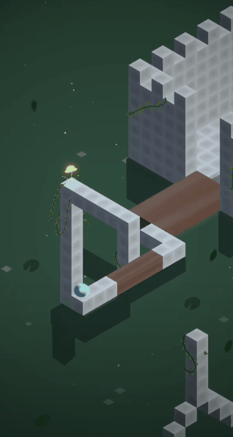
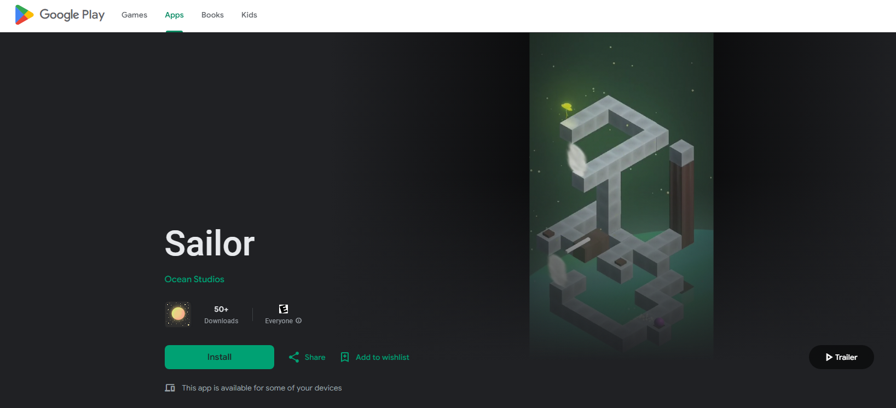

## Project info

__Engine:__ Unity

__Platforms:__ Android

__Team members:__ 3

### About 

Sailor is a 3D puzzle game inspired by Monument Valley. You have lost your original body and now you must get it back by collecting the rosses across every level.

## Features

- Intuitive controls: tap on the platforms to move.
- Move platforms: drag and rotate the platforms to position them correctly.
- Relaxing atmosphere: immerse yourself into the game's world and unwind with the visuals, music and sounds.



## What I did

I was in charge of most of the coding, my main tasks included:

- Systems programming: implemented core systems such as game and player states, audio management and saving system.
- Gameplay programming: handled player movement (pathfinding) and path condition system.
- UI programming: developed a functional main menu, that also works as a level selector, along with settings and pause menus using DOTween.
- Cinematic: created the introductory cinematic using Unity's Timeline feature.

The most crucial part was the pathfinding system, which I'll elaborate below.

### Pathfinding
One of my tasks was to create the pathfinding system. The game relies on perspective illusions where not every platform is physically connected, so each block acts as a node, storing its possible connection through a `Walkable` class, so only the blocks which had that class were able to be walked on.

When the player selects a destination, the system searches for a route by checking the connected nodes and identify which blcoks are reachable thorough the function `ExploreBlock`.

```csharp
private void ExploreBlock(List<Transform> nextBlocks, List<Transform> visited)
{
    Transform currentBlock = nextBlocks.First();
    nextBlocks.Remove(currentBlock);
    if (currentBlock == clickedCube) return;

    foreach (WalkPath path in currentBlock.GetComponent<Walkable>().possiblePaths)
    {
        if (!visited.Contains(path.target) && path.active)
        {
            nextBlocks.Add(path.target);
            path.target.GetComponent<Walkable>().previousBlock = currentBlock;
        }
    }

    visited.Add(currentBlock);
    if (nextBlocks.Any()) ExploreCube(nextBlocks, visited);
}
```

After the exploration is done, the route is build by tracing each of the cube's previous block reference from the destination to the starting point.

```csharp
private void BuildPath()
{
    Transform block = clickedBlock;

    while (block != currentBlock)
    {
        finalPath.Add(block);
        block = block.GetComponent<Walkable>().previousBlock;
    }
    
    finalPath.Insert(0, clickedBlock);
    FollowPath();
}
```

Finally, the player can do the movement along the generated route using DOTween.

```csharp
private void FollowPath()
{
    Sequence s = DOTween.Sequence();

    for (int i = finalPath.Count - 1; i > 0; i--)
    {
        var target = finalPath[i].GetComponent<Walkable>();
        float duration = target.isStair ? 0.3f : 0.2f;
        s.Append(transform.DOMove(target.GetWalkPoint(), duration).SetEase(Ease.Linear));
    }

    s.AppendCallback(() => Clear());
}
```

All these steps where called in a main `FindPath` class.

```csharp
private void FindPath()
{
    foreach (WalkPath path in currentBlock.GetComponent<Walkable>().possiblePaths)
    {
        if (path.active)
        {
            nextBlocks.Add(path.target);
            path.target.GetComponent<Walkable>().previousBlock = currentBlock;
        }
    }
    
    ExploreCube(nextBlocks, pastBlocks);
    BuildPath();
}
```



#### Path conditions

As a part of the pathfinding system, I had to implement conditions work to handle the platforms connect after the player drags or moves them complete the path. 

There were two types of platforms, the ones that have to be rotated, and the ones that had to be moved  along a horizontal or vertical axis. So I made a list for each type, `List<RotationPathCondition>` and `List<PositionPathCondition>`, which stored the expected rotation or position for each platform. Those values were compared against the platform's current transform to determine if the path should be active or not.


## Google Play

The game was originally shipped to the [Google Play](https://play.google.com/store/apps/details?id=com.OceanStudios.SailorDemo&hl=en_US) store.




**DISCLAIMER:** The Google Play link might've expired due to issues with the maintenance of the game's page apk.


## Credits

- 2D / 3D Art & Textures: [Victor Contreras](https://www.instagram.com/the_little_art1st/)
- Level design: [Ivan Antonio](https://www.linkedin.com/in/ixal8/)
- Gameplay programming (platform movement and interaction): [Ivan Antonio](https://www.linkedin.com/in/ixal8/)

